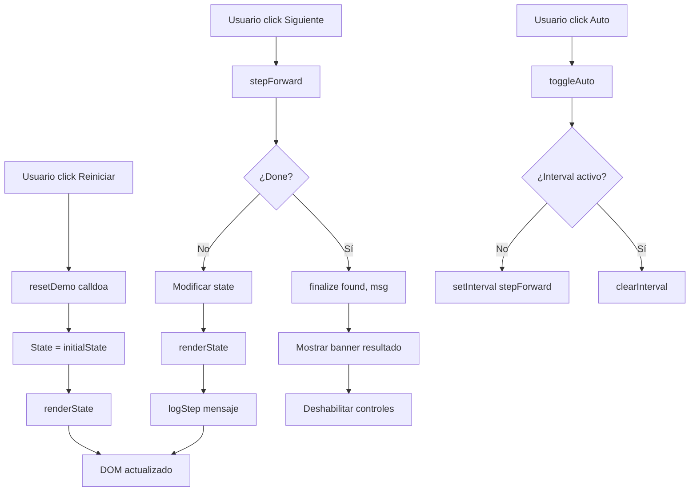

# 🎯 GUÍA COMPLETA DE IMPLEMENTACIÓN - Plataforma Interactiva de Algoritmos

> **Documentación Exhaustiva para IA y Desarrolladores**  
> **Última actualización:** 13 de Marzo, 2026  
> **Versión:** 2.0  
> **Stack:** Astro 4 + Vanilla JavaScript + CSS Variables

---

## 📑 ÍNDICE COMPLETO

1. [Visión General del Proyecto](#1-visión-general-del-proyecto)
2. [Arquitectura del Sistema](#2-arquitectura-del-sistema)
3. [Sistema de Diseño y Estilos](#3-sistema-de-diseño-y-estilos)
4. [Estructura de Archivos Detallada](#4-estructura-de-archivos-detallada)
5. [Motor de Visualización (VisualizerEngine)](#5-motor-de-visualización-visualizerengine)
6. [Componentes Astro Reutilizables](#6-componentes-astro-reutilizables)
7. [Sistema de Datos (algorithms.json)](#7-sistema-de-datos-algorithmsjson)
8. [Flujo de Renderizado y Navegación](#8-flujo-de-renderizado-y-navegación)
9. [Guía Paso a Paso: Crear un Nuevo Algoritmo](#9-guía-paso-a-paso-crear-un-nuevo-algoritmo)
10. [Patrones de Implementación por Tipo](#10-patrones-de-implementación-por-tipo)
11. [Sistema de Logs Pedagógicos](#11-sistema-de-logs-pedagógicos)
12. [Controles Interactivos y Auto-Play](#12-controles-interactivos-y-auto-play)
13. [Testing y Quality Assurance](#13-testing-y-quality-assurance)
14. [Deployment y Build](#14-deployment-y-build)
15. [Troubleshooting Común](#15-troubleshooting-común)
16. [Referencia Rápida de APIs](#16-referencia-rápida-de-apis)

---

## 1. VISIÓN GENERAL DEL PROYECTO

### 1.1 ¿Qué es este proyecto?

Una **plataforma educativa interactiva** que enseña **110 algoritmos** mediante visualizadores paso a paso. Cada algoritmo tiene:

- **Página propia** con URL única (`/algoritmos/nombre-algoritmo`)
- **3 tabs educativos**: "¿Qué es?", "¿Cómo funciona?", "Pruébalo"
- **Visualizador animado** que muestra cada paso del algoritmo
- **Log pedagógico** que explica QUÉ hace, POR QUÉ lo hace, y CUÁL fue la decisión
- **Controles interactivos**: paso a paso, reproducción automática, velocidad ajustable
- **Sistema de progreso** guardado en localStorage

### 1.2 Stack Tecnológico

```yaml
Framework: Astro 4.16.18
  - Output: static (generación estática)
  - Rutas dinámicas: [slug].astro para 110 algoritmos
  
JavaScript: Vanilla JS (ES6+)
  - No frameworks (React/Vue/Svelte)
  - Módulos ES6 nativos
  - Event listeners nativos
  
CSS: Variables CSS + CSS Moderno
  - Sistema de diseño coherente
  - Dark theme obligatorio
  - Responsive (móvil-primero)
  
Tipografías:
  - Syne: Títulos y UI
  - Space Mono: Código y valores numéricos
```

### 1.3 Principios No Negociables

1. **Render completo, nunca parcial** - Se re-renderiza TODO el DOM en cada paso
2. **Logs pedagógicos obligatorios** - Cada paso explica QUÉ, POR QUÉ, CUÁL
3. **Componentes autocontenidos** - Cada visualizador funciona independientemente
4. **Sistema de diseño inmutable** - Mismas variables CSS en todos los algoritmos
5. **Accesibilidad desde el inicio** - ARIA labels, teclado, reduced-motion

---

## 2. ARQUITECTURA DEL SISTEMA

### 2.1 Diagrama de Flujo

```
┌─────────────────────────────────────────────────────────────┐
│                    ENTRADA DEL USUARIO                       │
│                   /algoritmos/sum-array                      │
└────────────────────────┬────────────────────────────────────┘
                         │
                         ▼
┌─────────────────────────────────────────────────────────────┐
│              ASTRO ROUTING ([slug].astro)                    │
│  - Lee algorithms.json                                       │
│  - Encuentra algoritmo por ID                                │
│  - Genera props para el componente                           │
└────────────────────────┬────────────────────────────────────┘
                         │
                         ▼
┌─────────────────────────────────────────────────────────────┐
│                   BASE LAYOUT                                │
│  - Variables CSS globales                                    │
│  - Fuentes (Syne, Space Mono)                                │
│  - Meta tags                                                 │
└────────────────────────┬────────────────────────────────────┘
                         │
                         ▼
┌─────────────────────────────────────────────────────────────┐
│                 PÁGINA DEL ALGORITMO                         │
│  ┌──────────────────────────────────────────────────────┐   │
│  │              HEADER (Título, Nivel, Tags)            │   │
│  └──────────────────────────────────────────────────────┘   │
│  ┌──────────────────────────────────────────────────────┐   │
│  │                  TAB SYSTEM                          │   │
│  │  ┌────────────┬──────────────┬─────────────────┐    │   │
│  │  │ ¿Qué es?  │ ¿Cómo funciona? │ ▶️ Pruébalo  │    │   │
│  │  └────────────┴──────────────┴─────────────────┘    │   │
│  │  ┌──────────────────────────────────────────────┐   │   │
│  │  │         VISUALIZER EMBED                     │   │   │
│  │  │  • ArrayBar components                       │   │   │
│  │  │  • Controls (Reiniciar, Paso, Auto)         │   │   │
│  │  │  • StepLog (registro de pasos)              │   │   │
│  │  │  • Motor de estados (stepForward, render)   │   │   │
│  │  └──────────────────────────────────────────────┘   │   │
│  └──────────────────────────────────────────────────────┘   │
│  ┌──────────────────────────────────────────────────────┐   │
│  │         NAVEGACIÓN (← Anterior | Siguiente →)        │   │
│  └──────────────────────────────────────────────────────┘   │
└─────────────────────────────────────────────────────────────┘
```

### 2.2 Flujo de Datos

```
algorithms.json
    ↓
[slug].astro (getStaticPaths)
    ↓
VisualizerEmbed (recibe props: algo)
    ↓
Inicialización del estado (state object)
    ↓
Usuario presiona "Siguiente paso"
    ↓
stepForward() → Modifica state
    ↓
renderState() → Re-renderiza DOM completo
    ↓
logStep() → Añade mensaje al log
    ↓
¿Terminó? → finalize() → Muestra banner de resultado
```

---

## 3. SISTEMA DE DISEÑO Y ESTILOS

### 3.1 Variables CSS Globales

```css
/* Archivo: src/layouts/BaseLayout.astro */
:root {
  /* ============================================
     PALETA BASE (NO MODIFICAR)
     ============================================ */
  --bg: #0a0a0f;           /* Fondo principal */
  --surface: #12121a;       /* Superficies elevadas */
  --card: #1a1a27;          /* Tarjetas y contenedores */
  --border: #2a2a40;        /* Bordes sutiles */
  
  /* ============================================
     COLORES DE ACENTO
     ============================================ */
  --accent: #7c3aed;        /* Violeta - Botones primarios, CTA */
  --accent2: #06b6d4;       /* Cyan - Títulos, links importantes */
  
  /* ============================================
     TEXTO
     ============================================ */
  --text: #e2e8f0;          /* Texto principal */
  --muted: #64748b;         /* Texto secundario, labels */
  
  /* ============================================
     ESTADOS DEL VISUALIZADOR
     ============================================ */
  --ptr-left: #f59e0b;      /* Puntero izquierdo / Elemento A */
  --ptr-right: #10b981;     /* Puntero derecho / Elemento B */
  --match: #ec4899;         /* Coincidencia encontrada */
  --error: #ef4444;         /* Error / Estado negativo */
  --swap: #8b5cf6;          /* Intercambio en progreso */
  --visited: #1e3a5f;       /* Nodo visitado (grafos) */
  --current: #f59e0b;       /* Nodo actual */
  --highlight: #fbbf24;     /* Resaltado general */
}
```

### 3.2 Tipografías

```css
/* Syne - Títulos y UI */
h1, h2, h3, h4, h5, h6, .tab-label, button {
  font-family: 'Syne', system-ui, sans-serif;
  font-weight: 700;
}

/* Space Mono - Código y valores numéricos */
code, pre, .mono, .cell-value, .log-box, .complexity-value {
  font-family: 'Space Mono', monospace;
  font-weight: 400;
}
```

### 3.3 Clases de Estado para Celdas

```css
/* Celda neutral (sin actividad) */
.cell {
  background: var(--surface);
  border: 2px solid var(--border);
  color: var(--text);
}

/* Puntero izquierdo / Elemento A */
.cell.active-a {
  border-color: var(--ptr-left);
  background: rgba(245, 158, 11, 0.15);
  transform: scale(1.1);
  box-shadow: 0 0 18px rgba(245, 158, 11, 0.35);
}

/* Puntero derecho / Elemento B */
.cell.active-b {
  border-color: var(--ptr-right);
  background: rgba(16, 185, 129, 0.15);
  transform: scale(1.1);
  box-shadow: 0 0 18px rgba(16, 185, 129, 0.35);
}

/* Ambos punteros (coincidencia) */
.cell.both-ptr,
.cell.match {
  border-color: var(--match);
  background: rgba(236, 72, 153, 0.18);
  transform: scale(1.15);
  box-shadow: 0 0 24px rgba(236, 72, 153, 0.5);
  animation: pulse 0.5s ease;
}

/* Swapping (intercambio) */
.cell.swapping {
  border-color: var(--swap);
  background: rgba(139, 92, 246, 0.15);
  animation: shake 0.3s ease;
}

/* Visitado (grafos/árboles) */
.cell.visited {
  background: var(--visited);
  opacity: 0.6;
}
```

### 3.4 Animaciones

```css
@keyframes pulse {
  0% { transform: scale(1); }
  50% { transform: scale(1.25); }
  100% { transform: scale(1.15); }
}

@keyframes shake {
  0%, 100% { transform: translateX(0); }
  25% { transform: translateX(-4px); }
  75% { transform: translateX(4px); }
}

@keyframes fadeIn {
  from { opacity: 0; transform: translateY(10px); }
  to { opacity: 1; transform: translateY(0); }
}
```

---

## 4. ESTRUCTURA DE ARCHIVOS DETALLADA

### 4.1 Árbol Completo del Proyecto

```
front-algoritmos/
├── 📁 public/                    # Assets estáticos
│   └── favicon.svg
│
├── 📁 src/
│   ├── 📁 components/            # Componentes reutilizables
│   │   ├── 📁 layout/
│   │   │   └── LevelBadge.astro        # Badge de nivel (0-4)
│   │   ├── 📁 roadmap/
│   │   │   └── AlgoCard.astro          # Tarjeta de algoritmo en roadmap
│   │   └── 📁 visualizer/
│   │       ├── ArrayBar.astro          # Celda de array individual
│   │       ├── Controls.astro          # Botones de control
│   │       ├── StepLog.astro           # Caja de logs
│   │       ├── TabSystem.astro         # Sistema de tabs
│   │       └── VisualizerEmbed.astro   # Embebido completo del visualizador
│   │
│   ├── 📁 data/
│   │   └── algorithms.json             # Catálogo de 110 algoritmos
│   │
│   ├── 📁 layouts/
│   │   ├── AlgoLayout.astro            # Layout específico para algoritmos
│   │   └── BaseLayout.astro            # Layout base con variables CSS
│   │
│   ├── 📁 pages/
│   │   ├── index.astro                 # Página principal (roadmap)
│   │   └── 📁 algoritmos/
│   │       ├── [slug].astro            # Ruta dinámica para cada algoritmo
│   │       └── demo-visualizer.astro   # Plantilla de ejemplo
│   │
│   ├── 📁 scripts/
│   │   └── visualizer-core.js          # Motor reutilizable de visualización
│   │
│   └── env.d.ts                        # Tipos de TypeScript
│
├── 📁 docs/                      # Documentación
│   ├── ALGO_IMPLEMENTATION_GUIDE.md    # Guía básica
│   ├── PHASE2_QA.md                    # Checklist de QA
│   └── VISUALIZER_API.md               # API del visualizador
│
├── 📄 astro.config.mjs           # Configuración de Astro
├── 📄 package.json               # Dependencias
├── 📄 tsconfig.json              # Configuración TypeScript
├── 📄 README.md                  # README del proyecto
├── 📄 ONE_SPEC.md                # Especificación técnica
├── 📄 PLAN_TRABAJO.md            # Plan de trabajo y fases
├── 📄 doblepuntero.html          # Referencia de diseño UX
└── 📄 GUIA_COMPLETA_IMPLEMENTACION.md  # Este archivo
```

### 4.2 Descripción de Cada Archivo Clave

#### `src/data/algorithms.json`
**Propósito:** Catálogo centralizado de los 110 algoritmos.  
**Contenido:** Array de objetos con metadatos de cada algoritmo.

```json
{
  "id": "sum-array",
  "name": "Suma de arreglo",
  "level": 0,
  "tags": ["arrays", "basico", "iteracion"],
  "complexity": "O(n)",
  "description": "Calcular la suma de todos los elementos en un arreglo",
  "hasVisualizer": true
}
```

#### `src/pages/algoritmos/[slug].astro`
**Propósito:** Ruta dinámica que genera una página por cada algoritmo.  
**Funcionamiento:**
- Astro ejecuta `getStaticPaths()` en build time
- Lee `algorithms.json` y genera 110 rutas estáticas
- Cada ruta recibe el objeto `algo` como prop
- Renderiza el layout con el visualizador embebido

#### `src/components/visualizer/VisualizerEmbed.astro`
**Propósito:** Componente principal que contiene la lógica del visualizador.  
**Responsabilidades:**
- Renderizar los 3 tabs (¿Qué es?, ¿Cómo funciona?, Pruébalo)
- Implementar la lógica específica del algoritmo en el tag `<script>`
- Gestionar el estado (`state` object)
- Proporcionar funciones: `resetDemo()`, `stepForward()`, `renderState()`, `finalize()`

#### `src/scripts/visualizer-core.js`
**Propósito:** Motor reutilizable de visualización (actualmente parcialmente implementado).  
**Estado actual:** Clase `VisualizerEngine` con métodos `step()`, `reset()`, `toggleAuto()`.  
**Uso futuro:** Será la base para todos los visualizadores, evitando duplicación de código.

#### `src/layouts/BaseLayout.astro`
**Propósito:** Layout raíz de la aplicación.  
**Contenido:**
- `<html>`, `<head>`, `<body>` base
- Variables CSS globales
- Links a fuentes de Google
- Meta tags

#### `doblepuntero.html`
**Propósito:** Archivo de referencia para el diseño UX.  
**Uso:** Es el "golden standard" de cómo debe verse y comportarse un visualizador.  
**Características clave:**
- Sistema de tabs funcional
- Array visual con celdas animadas
- Log pedagógico
- Controles de paso a paso y auto-play
- Slider de velocidad

---

## 5. MOTOR DE VISUALIZACIÓN (VisualizerEngine)

### 5.1 Arquitectura del Motor

El motor sigue el patrón **Composición sobre Herencia**:
- **NO** heredas de una clase base
- **SÍ** inyectas callbacks con la lógica específica

```javascript
// Archivo: src/scripts/visualizer-core.js

export class VisualizerEngine {
  constructor(config) {
    // Callbacks requeridos
    this.onStepCallback = config.onStep;       // Lógica del paso
    this.onRenderCallback = config.onRender;   // Actualizar UI
    this.onCompleteCallback = config.onComplete; // Al terminar
    this.onResetCallback = config.onReset;     // Al reiniciar
    
    // Estado
    this.currentState = { ...config.initialState };
    this.engineState = 'initial'; // initial|running|paused|completed
    
    // Auto-play
    this.autoInterval = null;
    this.speed = config.defaultSpeed || 900; // ms entre pasos
  }
  
  step() {
    // Ejecuta un paso del algoritmo
    const result = this.onStepCallback(this.currentState);
    if (result.data) {
      this.currentState = { ...this.currentState, ...result.data };
    }
    this.onRenderCallback(this.currentState);
    
    if (!result.continue) {
      this.engineState = 'completed';
      this.onCompleteCallback(this.currentState);
      this.stopAuto();
    }
  }
  
  reset() {
    this.stopAuto();
    this.currentState = { ...this.initialState };
    this.engineState = 'initial';
    this.onResetCallback();
    this.onRenderCallback(this.currentState);
  }
  
  toggleAuto() {
    if (this.autoInterval) {
      this.stopAuto();
      return false;
    } else {
      this.startAuto();
      return true;
    }
  }
  
  startAuto() {
    this.engineState = 'running';
    this.autoInterval = setInterval(() => {
      this.step();
    }, this.speed);
  }
  
  stopAuto() {
    clearInterval(this.autoInterval);
    this.autoInterval = null;
    if (this.engineState === 'running') {
      this.engineState = 'paused';
    }
  }
  
  setSpeed(ms) {
    this.speed = Math.max(300, Math.min(2000, ms));
    if (this.autoInterval) {
      this.stopAuto();
      this.startAuto();
    }
  }
}
```

### 5.2 Estados del Motor

```typescript
type EngineState = 'initial' | 'running' | 'paused' | 'completed';

// Transiciones permitidas:
initial → running (click Auto)
initial → paused (click Siguiente)
running → paused (click Auto para pausar)
running → completed (algoritmo terminó)
paused → running (click Auto)
paused → completed (último paso alcanzado)
completed → initial (click Reiniciar)
```

### 5.3 Estructura Típica del State

```javascript
const state = {
  // Datos del algoritmo
  array: [3, 1, 4, 1, 5, 9],
  target: 10,
  
  // Punteros e índices
  i: 0,          // Índice principal
  j: 1,          // Índice secundario
  l: 0,          // Left pointer
  r: 5,          // Right pointer
  
  // Acumuladores
  acc: 0,        // Acumulador general
  sum: 0,        // Suma actual
  count: 0,      // Contador
  
  // Estados visuales
  activeA: -1,   // Índice del elemento activo A
  activeB: -1,   // Índice del elemento activo B
  matchIndex: -1, // Índice de coincidencia
  
  // Resultados
  result: null,  // Resultado final
  found: false,  // ¿Se encontró solución?
  
  // Logs
  log: [],       // Array de strings HTML
  
  // Control
  step: 0,       // Número de paso actual
  done: false    // ¿Algoritmo terminado?
};
```

---

## 6. COMPONENTES ASTRO REUTILIZABLES

### 6.1 TabSystem.astro

**Ubicación:** `src/components/visualizer/TabSystem.astro`

**Props:**
```typescript
interface Tab {
  id: string;      // Identificador único
  icon: string;    // Emoji o carácter
  label: string;   // Texto del tab
}

interface Props {
  tabs: Tab[];
  defaultTab?: string;  // ID del tab activo inicialmente
}
```

**Uso:**
```astro
<TabSystem 
  tabs={[
    { id: 'what', icon: '🧠', label: '¿Qué es?' },
    { id: 'how', icon: '📋', label: '¿Cómo funciona?' },
    { id: 'demo', icon: '▶️', label: 'Pruébalo' }
  ]}
  defaultTab="what"
>
  <div slot="what">Contenido del tab 1</div>
  <div slot="how">Contenido del tab 2</div>
  <div slot="demo">Contenido del tab 3</div>
</TabSystem>
```

**Script interno:**
- Maneja clicks en los headers de tabs
- Oculta/muestra panels con clases `.active`
- Copia contenido de slots a los panels
- Navegación por teclado (Arrow Left/Right)

### 6.2 ArrayBar.astro

**Ubicación:** `src/components/visualizer/ArrayBar.astro`

**Props:**
```typescript
interface Props {
  value: number | string;
  index: number;
  state?: 'neutral' | 'active-a' | 'active-b' | 'match' | 'swapping' | 'visited';
  label?: string;  // Label opcional encima/debajo
}
```

**Renderiza:**
```html
<div class="cell-wrap">
  <span class="ptr-label">{label}</span>
  <div class="cell {state}">
    <div class="cell-value">{value}</div>
  </div>
  <span class="idx-label">{index}</span>
</div>
```

### 6.3 Controls.astro

**Ubicación:** `src/components/visualizer/Controls.astro`

**Props:**
```typescript
interface Props {
  disabled?: boolean;  // Deshabilitar todos los controles
}
```

**Renderiza:**
```html
<div class="controls">
  <button id="reset-btn" class="btn btn-secondary">🔄 Reiniciar</button>
  <button id="step-btn" class="btn btn-primary">Siguiente paso →</button>
  <button id="auto-btn" class="btn btn-cyan">▶ Auto</button>
</div>
```

**IDs importantes:**
- `#reset-btn` - Botón de reinicio
- `#step-btn` - Siguiente paso
- `#auto-btn` - Play/Pause automático

### 6.4 StepLog.astro

**Ubicación:** `src/components/visualizer/StepLog.astro`

**Renderiza:**
```html
<div id="log-box" class="log-box" aria-live="polite">
  <!-- Los mensajes se insertan dinámicamente -->
</div>
```

**Helper function (incluida en el script):**
```javascript
function logStep(htmlMessage) {
  const logBox = document.getElementById('log-box');
  const entry = document.createElement('div');
  entry.className = 'log-entry';
  entry.innerHTML = `<span class="step-num">Paso ${state.step}:</span> ${htmlMessage}`;
  logBox.appendChild(entry);
  logBox.scrollTop = logBox.scrollHeight; // Auto-scroll al final
}
```

### 6.5 VisualizerEmbed.astro

**Ubicación:** `src/components/visualizer/VisualizerEmbed.astro`

**Estructura interna:**
```astro
---
import TabSystem from './TabSystem.astro';
const { algo } = Astro.props;
---

<TabSystem tabs={...}>
  <div slot="what">
    <!-- Analogía del algoritmo -->
  </div>
  
  <div slot="how">
    <!-- Pasos del algoritmo -->
  </div>
  
  <div slot="demo">
    <div class="problem-card">...</div>
    <div id="array-area"></div>
    <div id="log-box"></div>
    <div id="result-banner"></div>
    <div class="controls-row">
      <input id="speed-slider" type="range" />
      <button id="step-btn">Siguiente paso</button>
      <button id="auto-btn">Auto</button>
    </div>
  </div>
</TabSystem>

<script type="module">
  // Estado inicial
  let state = { ... };
  
  // Funciones del motor
  function resetDemo() { ... }
  function stepForward() { ... }
  function renderState() { ... }
  function finalize(found, message) { ... }
  function toggleAuto() { ... }
  
  // Event listeners
  document.getElementById('step-btn').addEventListener('click', stepForward);
  document.getElementById('auto-btn').addEventListener('click', toggleAuto);
  document.getElementById('reset-btn').addEventListener('click', resetDemo);
</script>
```

---

## 7. SISTEMA DE DATOS (algorithms.json)

### 7.1 Esquema Completo

```typescript
interface Algorithm {
  id: string;              // Slug único (kebab-case)
  name: string;            // Nombre legible
  level: 0 | 1 | 2 | 3 | 4; // Nivel de dificultad
  tags: string[];          // Tags descriptivos
  complexity: string;      // Notación Big-O
  description: string;     // Descripción corta
  hasVisualizer: boolean;  // ¿Tiene visualizador implementado?
  
  // Opcionales (pueden añadirse en el futuro)
  what?: string;           // HTML del tab "¿Qué es?"
  how?: string;            // HTML del tab "¿Cómo funciona?"
  examples?: {             // Ejemplos demo
    default: { arr: number[], target?: number };
  };
}
```

### 7.2 Ejemplo Real

```json
{
  "id": "two-sum-brute",
  "name": "Two Sum fuerza bruta",
  "level": 0,
  "tags": ["arrays", "basico", "nested-loops"],
  "complexity": "O(n²)",
  "description": "Encontrar dos números que sumen un objetivo usando fuerza bruta",
  "hasVisualizer": true,
  "examples": {
    "default": {
      "arr": [3, 2, 4, 6, 1, 5],
      "target": 9
    }
  }
}
```

### 7.3 Niveles de Dificultad

| Nivel | Nombre | Cantidad | Descripción |
|-------|--------|----------|-------------|
| 0 | Cero Absoluto | 10 | Arrays básicos, bucles simples |
| 1 | Principiante | 20 | Stacks, queues, two pointers |
| 2 | Intermedio | 25 | Sorting avanzado, DP básico, árboles |
| 3 | Avanzado | 30 | Grafos, backtracking, DP complejo |
| 4 | Experto | 25 | Estructuras avanzadas, algoritmos complejos |

---

## 8. FLUJO DE RENDERIZADO Y NAVEGACIÓN

### 8.1 Build Time (Generación Estática)

```javascript
// src/pages/algoritmos/[slug].astro

export function getStaticPaths() {
  const algorithms = Astro.import('../../data/algorithms.json');
  
  return algorithms.map((algo) => ({
    params: { slug: algo.id },  // URL /algoritmos/sum-array
    props: { algo }              // Props pasadas al componente
  }));
}

// Resultado: 110 páginas HTML estáticas generadas
```

### 8.2 Runtime (Navegación del Usuario)

```
1. Usuario visita /algoritmos/sum-array
2. Navegador carga sum-array.html (estático)
3. Astro renderiza BaseLayout
4. BaseLayout inyecta variables CSS
5. Página renderiza header del algoritmo
6. VisualizerEmbed renderiza con props { algo }
7. TabSystem inicializa con tab "what" activo
8. Script de cliente ejecuta y prepara el motor
9. Usuario click en tab "demo"
10. TabSystem cambia a panel demo
11. Usuario click "Siguiente paso"
12. stepForward() → modifica state → renderState()
13. DOM se actualiza con nuevas clases CSS
14. Animaciones CSS se activan automáticamente
```

### 8.3 Flujo del Visualizador



---

## 9. GUÍA PASO A PASO: CREAR UN NUEVO ALGORITMO

### 9.1 Checklist General

- [ ] 1. Añadir entrada en `algorithms.json`
- [ ] 2. Crear rama en el switch del algoritmo o archivo dedicado
- [ ] 3. Definir estado inicial (`state`)
- [ ] 4. Implementar lógica `stepForward()`
- [ ] 5. Implementar render `renderState()`
- [ ] 6. Añadir logs pedagógicos con `logStep()`
- [ ] 7. Implementar condición de finalización `finalize()`
- [ ] 8. Escribir contenido de tabs "¿Qué es?" y "¿Cómo funciona?"
- [ ] 9. Probar manualmente con diferentes casos
- [ ] 10. Verificar en móvil (responsive)

### 9.2 PASO 1: Añadir en algorithms.json

**Archivo:** `src/data/algorithms.json`

```json
{
  "id": "bubble-sort",
  "name": "Bubble Sort",
  "level": 1,
  "tags": ["ordenamiento", "sorting", "comparacion"],
  "complexity": "O(n²)",
  "description": "Ordenamiento mediante intercambios de elementos adyacentes",
  "hasVisualizer": true
}
```

**Campos importantes:**
- `id`: Slug único (se usa en la URL)
- `hasVisualizer`: Cambiar a `true` cuando implementes el visualizador

### 9.3 PASO 2: Implementar en VisualizerEmbed.astro

**Opción A: Añadir al switch existente**

```javascript
// Dentro de src/components/visualizer/VisualizerEmbed.astro
// En el <script type="module">

function stepForward() {
  if (state.done) return;
  state.step++;
  
  switch(algoId) {
    case 'bubble-sort':
      // Tu lógica aquí
      if (state.i < state.array.length - 1) {
        if (state.j < state.array.length - state.i - 1) {
          state.activeA = state.j;
          state.activeB = state.j + 1;
          
          logStep(`Comparando <span class="log-a">${state.array[state.j]}</span> con <span class="log-b">${state.array[state.j + 1]}</span>`);
          
          if (state.array[state.j] > state.array[state.j + 1]) {
            // Swap
            [state.array[state.j], state.array[state.j + 1]] = 
              [state.array[state.j + 1], state.array[state.j]];
            
            logStep(`Intercambio: ${state.array[state.j]} ↔ ${state.array[state.j + 1]}`);
          } else {
            logStep(`No hace falta intercambiar`);
          }
          
          state.j++;
        } else {
          state.i++;
          state.j = 0;
          logStep(`Pasada ${state.i} completada`);
        }
      } else {
        finalize(true, 'Array ordenado correctamente');
      }
      break;
      
    // ... otros casos
  }
  
  renderState();
}
```

**Opción B: Archivo modular (recomendado para muchos algoritmos)**

Crear `src/scripts/visualizers/bubble-sort.js`:

```javascript
export function init(params) {
  return {
    array: params.array || [5, 2, 8, 1, 9],
    i: 0,
    j: 0,
    activeA: -1,
    activeB: -1,
    step: 0,
    done: false,
    log: []
  };
}

export function step(state) {
  if (state.i < state.array.length - 1) {
    if (state.j < state.array.length - state.i - 1) {
      state.activeA = state.j;
      state.activeB = state.j + 1;
      
      const message = `Comparando ${state.array[state.j]} con ${state.array[state.j + 1]}`;
      
      if (state.array[state.j] > state.array[state.j + 1]) {
        [state.array[state.j], state.array[state.j + 1]] = 
          [state.array[state.j + 1], state.array[state.j]];
      }
      
      state.j++;
      return { continue: true, message };
    } else {
      state.i++;
      state.j = 0;
      return { continue: true, message: `Pasada ${state.i} completada` };
    }
  } else {
    state.done = true;
    return { continue: false, message: 'Array ordenado' };
  }
}

export function renderHints(state) {
  return {
    activeA: state.activeA,
    activeB: state.activeB
  };
}
```

Luego en `VisualizerEmbed.astro`:

```javascript
// Dynamic import del módulo
const algoModule = await import(`../../scripts/visualizers/${algoId}.js`);

let state = algoModule.init({ array: DEMO_ARRAY });

function stepForward() {
  const result = algoModule.step(state);
  logStep(result.message);
  renderState();
  
  if (!result.continue) {
    finalize(true, 'Completado');
  }
}
```

### 9.4 PASO 3: Definir Estado Inicial

**Reglas:**
1. Incluye todo lo necesario para representar el algoritmo
2. No incluyas datos derivados (calcula en render)
3. Usa nombres descriptivos
4. Documenta cada campo

```javascript
const DEMO_ARRAY = [5, 2, 8, 1, 9]; // Array fijo de demo

let state = {
  // Datos principales
  array: [...DEMO_ARRAY],  // Copiar para no mutar original
  target: 10,              // Si aplica
  
  // Índices y punteros
  i: 0,
  j: 0,
  
  // Estados visuales (cuál celda resaltar)
  activeA: -1,  // -1 = ninguna
  activeB: -1,
  matchIndex: -1,
  
  // Progreso
  step: 0,
  done: false,
  
  // Resultados
  result: null,
  found: false,
  
  // Logs
  log: []
};
```

### 9.5 PASO 4: Implementar stepForward()

**Estructura base:**

```javascript
function stepForward() {
  // 1. Verificar si ya terminó
  if (state.done) {
    console.warn('Algoritmo ya terminó');
    return;
  }
  
  // 2. Incrementar contador de pasos
  state.step++;
  
  // 3. LÓGICA ESPECÍFICA DEL ALGORITMO
  // ... tu código aquí ...
  
  // 4. Añadir log explicativo
  logStep(`Mensaje pedagógico del paso ${state.step}`);
  
  // 5. Verificar condición de finalización
  if (condicionDeTerminacion) {
    finalize(true, 'Mensaje de éxito');
    return;
  }
  
  // 6. Re-renderizar
  renderState();
}
```

**Ejemplo completo (Linear Search):**

```javascript
function stepForward() {
  if (state.done) return;
  
  state.step++;
  const target = parseInt(document.getElementById('target-input').value);
  
  if (state.i < state.array.length) {
    state.activeA = state.i;
    
    logStep(
      `Comparando elemento en índice <span class="highlight">${state.i}</span> ` +
      `(valor <span class="log-a">${state.array[state.i]}</span>) ` +
      `con el objetivo <span class="match-c">${target}</span>`
    );
    
    if (state.array[state.i] === target) {
      state.matchIndex = state.i;
      finalize(true, `¡Encontrado en índice ${state.i}!`);
      return;
    } else {
      logStep(`No coincide. Continuando...`);
      state.i++;
    }
  } else {
    finalize(false, `Objetivo ${target} no encontrado en el array`);
    return;
  }
  
  renderState();
}
```

### 9.6 PASO 5: Implementar renderState()

**Reglas de oro:**
1. **Render completo**, no parcial (re-crear todo el HTML)
2. Lee el `state` actual
3. NO modifiques el `state` aquí
4. Usa clases CSS para estados visuales

```javascript
function renderState() {
  const arrayArea = document.getElementById('array-area');
  
  // Generar HTML completo del array
  arrayArea.innerHTML = state.array.map((value, index) => {
    // Determinar clases CSS según el estado
    let classes = ['cell'];
    let label = '';
    
    if (index === state.activeA) {
      classes.push('active-a');
      label = '<span class="ptr-label L">L</span>';
    }
    
    if (index === state.activeB) {
      classes.push('active-b');
      label = '<span class="ptr-label R">R</span>';
    }
    
    if (index === state.matchIndex) {
      classes.push('match');
      label = '<span class="ptr-label B">✓</span>';
    }
    
    // Si ambos punteros coinciden
    if (index === state.activeA && index === state.activeB) {
      classes = ['cell', 'both-ptr'];
      label = '<span class="ptr-label B">L+R</span>';
    }
    
    return `
      <div class="cell-wrap">
        ${label}
        <div class="${classes.join(' ')}">
          <div class="cell-value">${value}</div>
        </div>
        <span class="idx-label">${index}</span>
      </div>
    `;
  }).join('');
  
  // Actualizar displays adicionales (si hay)
  const stateDisplay = document.getElementById('state-display');
  if (stateDisplay) {
    stateDisplay.textContent = `Paso ${state.step} - i: ${state.i}`;
  }
}
```

**Variante para algoritmos con sum display:**

```javascript
function renderState() {
  // Renderizar array (igual que antes)
  const arrayArea = document.getElementById('array-area');
  arrayArea.innerHTML = state.array.map((val, idx) => {
    let classes = ['cell'];
    if (idx === state.l) classes.push('left-ptr');
    if (idx === state.r) classes.push('right-ptr');
    
    return `
      <div class="cell-wrap">
        <span class="ptr-label ${idx === state.l ? 'L' : ''}">${idx === state.l ? 'L' : ''}</span>
        <div class="${classes.join(' ')}">
          <div class="cell-value">${val}</div>
        </div>
        <span class="idx-label">${idx}</span>
      </div>
    `;
  }).join('');
  
  // Renderizar suma display
  const sumDisplay = document.getElementById('sum-display');
  const leftVal = state.array[state.l];
  const rightVal = state.array[state.r];
  const currentSum = leftVal + rightVal;
  
  let sumClass = 'sum-result';
  if (currentSum > state.target) sumClass += ' too-big';
  if (currentSum < state.target) sumClass += ' too-small';
  if (currentSum === state.target) sumClass += ' match';
  
  sumDisplay.innerHTML = `
    <div class="sum-item">
      <span class="sum-lbl">L</span>
      <span class="sum-val left-c">${leftVal}</span>
    </div>
    <span class="sum-eq">+</span>
    <div class="sum-item">
      <span class="sum-lbl">R</span>
      <span class="sum-val right-c">${rightVal}</span>
    </div>
    <span class="sum-eq">=</span>
    <span class="${sumClass}">${currentSum}</span>
  `;
}
```

### 9.7 PASO 6: Implementar finalize()

**Propósito:** Mostrar resultado final y deshabilitar controles.

```javascript
function finalize(found, message) {
  state.done = true;
  
  // Detener auto-play si está activo
  if (autoInterval) {
    clearInterval(autoInterval);
    autoInterval = null;
    document.getElementById('auto-btn').textContent = '▶ Auto';
    document.getElementById('playing-badge').style.display = 'none';
  }
  
  // Mostrar banner de resultado
  const resultBanner = document.getElementById('result-banner');
  resultBanner.className = 'result-banner ' + (found ? 'success' : 'fail');
  resultBanner.textContent = message;
  resultBanner.style.display = 'block';
  
  // Deshabilitar botón "Siguiente paso"
  document.getElementById('step-btn').disabled = true;
  document.getElementById('auto-btn').disabled = true;
  
  // Log final
  logStep(`<strong>${message}</strong>`);
}
```

### 9.8 PASO 7: Implementar resetDemo()

```javascript
function resetDemo() {
  // Detener auto-play si está activo
  if (autoInterval) {
    clearInterval(autoInterval);
    autoInterval = null;
  }
  
  // Resetear estado al inicial
  state = {
    array: [...DEMO_ARRAY],  // Copiar array original
    i: 0,
    j: 0,
    activeA: -1,
    activeB: -1,
    matchIndex: -1,
    step: 0,
    done: false,
    result: null,
    found: false,
    log: []
  };
  
  // Limpiar UI
  document.getElementById('log-box').innerHTML = '';
  document.getElementById('result-banner').style.display = 'none';
  document.getElementById('playing-badge').style.display = 'none';
  
  // Habilitar controles
  document.getElementById('step-btn').disabled = false;
  document.getElementById('auto-btn').disabled = false;
  document.getElementById('auto-btn').textContent = '▶ Auto';
  
  // Resetear input target si existe
  const targetInput = document.getElementById('target-input');
  if (targetInput) {
    targetInput.value = DEFAULT_TARGET;
  }
  
  // Re-renderizar estado inicial
  renderState();
  
  // Log inicial
  logStep('Demo reiniciado. Presiona "Siguiente paso" para comenzar.');
}
```

### 9.9 PASO 8: Implementar toggleAuto()

```javascript
let autoInterval = null;
let speed = 900; // ms entre pasos

function toggleAuto() {
  if (state.done) {
    alert('El algoritmo ya terminó. Presiona "Reiniciar" para volver a ejecutar.');
    return;
  }
  
  if (autoInterval) {
    // Pausar
    clearInterval(autoInterval);
    autoInterval = null;
    document.getElementById('auto-btn').textContent = '▶ Auto';
    document.getElementById('playing-badge').style.display = 'none';
  } else {
    // Iniciar
    autoInterval = setInterval(() => {
      stepForward();
      
      // Detener si terminó
      if (state.done) {
        clearInterval(autoInterval);
        autoInterval = null;
        document.getElementById('auto-btn').textContent = '▶ Auto';
        document.getElementById('playing-badge').style.display = 'none';
      }
    }, speed);
    
    document.getElementById('auto-btn').textContent = '⏸ Pausar';
    document.getElementById('playing-badge').style.display = 'inline';
  }
}

// Event listener del slider de velocidad
document.getElementById('speed-slider').addEventListener('input', (e) => {
  speed = parseInt(e.target.value);
  
  // Si auto está activo, reiniciar con nueva velocidad
  if (autoInterval) {
    clearInterval(autoInterval);
    autoInterval = setInterval(stepForward, speed);
  }
});
```

### 9.10 PASO 9: Escribir Contenido Educativo

**Tab "¿Qué es?"**

Reglas:
- Usa una **analogía cotidiana** (no técnica)
- Explica para qué sirve en el mundo real
- Máximo 2-3 párrafos

Ejemplo (Bubble Sort):

```html
<div slot="what" class="tab-content">
  <div class="analogy-card">
    <h2>🫧 Analogía cotidiana</h2>
    <p>
      Imagina que tienes una <strong>fila de personas</strong> de diferentes alturas 
      y quieres ordenarlas de más baja a más alta. Empiezas por el inicio: comparas 
      las dos primeras personas, y si la segunda es más baja, las intercambias de lugar.
    </p>
    <p>
      Luego haces lo mismo con las siguientes dos, y así sucesivamente hasta el final. 
      Repites este proceso varias veces hasta que toda la fila esté ordenada. 
      Es como <strong>burbujas que suben a la superficie</strong>: los valores más grandes 
      van "flotando" hacia el final.
    </p>
  </div>
  
  <div class="why-card">
    <h3>¿Para qué sirve?</h3>
    <p>
      Bubble Sort es uno de los algoritmos de ordenamiento más simples, perfecto para aprender. 
      Aunque no es eficiente para listas grandes (O(n²)), es útil para:
    </p>
    <ul>
      <li>Entender los conceptos básicos de ordenamiento</li>
      <li>Visualizar cómo funcionan los intercambios</li>
      <li>Ordenar listas pequeñas donde la simplicidad importa más que la velocidad</li>
    </ul>
  </div>
</div>
```

**Tab "¿Cómo funciona?"**

Reglas:
- Lista numerada de pasos
- Cada paso es una acción concreta
- Usa ejemplos visuales si ayuda

Ejemplo (Bubble Sort):

```html
<div slot="how" class="tab-content">
  <div class="steps-card">
    <h2>📋 Pasos del algoritmo</h2>
    <ol class="steps-list">
      <li>
        <span class="step-num">1</span>
        <div class="step-content">
          <strong>Inicializar:</strong> Empezar en el primer elemento del array (índice 0)
        </div>
      </li>
      <li>
        <span class="step-num">2</span>
        <div class="step-content">
          <strong>Comparar pares adyacentes:</strong> Comparar elemento[i] con elemento[i+1]
        </div>
      </li>
      <li>
        <span class="step-num">3</span>
        <div class="step-content">
          <strong>Intercambiar si es necesario:</strong> Si elemento[i] > elemento[i+1], 
          intercambiarlos
        </div>
      </li>
      <li>
        <span class="step-num">4</span>
        <div class="step-content">
          <strong>Avanzar:</strong> Continuar con el siguiente par hasta el final del array
        </div>
      </li>
      <li>
        <span class="step-num">5</span>
        <div class="step-content">
          <strong>Repetir:</strong> Volver al inicio y repetir el proceso. Con cada pasada, 
          el elemento más grande "burbujea" al final
        </div>
      </li>
      <li>
        <span class="step-num">6</span>
        <div class="step-content">
          <strong>Finalizar:</strong> Cuando una pasada completa no hace ningún intercambio, 
          el array está ordenado
        </div>
      </li>
    </ol>
    
    <div class="complexity-card">
      <h3>⏱️ Complejidad</h3>
      <ul>
        <li><strong>Tiempo (peor caso):</strong> O(n²) - dos bucles anidados</li>
        <li><strong>Tiempo (mejor caso):</strong> O(n) - si ya está ordenado</li>
        <li><strong>Espacio:</strong> O(1) - ordena in-place, sin memoria extra</li>
      </ul>
    </div>
  </div>
</div>
```

---

## 10. PATRONES DE IMPLEMENTACIÓN POR TIPO

### 10.1 Algoritmos de Búsqueda

**Características comunes:**
- Array fijo + input de target
- Índice principal `i`
- Estado `matchIndex` para marcar donde se encontró
- Banner de éxito/fracaso

**Ejemplo: Linear Search**

```javascript
// Estado
const state = {
  array: [2, 7, 11, 15, 3, 6],
  target: 11,
  i: 0,
  matchIndex: -1,
  done: false
};

// stepForward
function stepForward() {
  if (state.i < state.array.length) {
    state.activeA = state.i;
    
    logStep(`Revisando índice ${state.i}: valor ${state.array[state.i]}`);
    
    if (state.array[state.i] === state.target) {
      state.matchIndex = state.i;
      finalize(true, `Encontrado en índice ${state.i}`);
    } else {
      state.i++;
    }
  } else {
    finalize(false, `No encontrado`);
  }
  
  renderState();
}
```

### 10.2 Algoritmos de Ordenamiento

**Características comunes:**
- Array mutable (se modifica en cada paso)
- Dos índices: `i` (pasada externa), `j` (comparación interna)
- Estados `swapping` para intercambios
- Comparaciones y swaps en cada paso

**Ejemplo: Bubble Sort**

```javascript
// Estado
const state = {
  array: [5, 2, 8, 1, 9],
  i: 0,  // Pasada actual
  j: 0,  // Índice de comparación
  swapped: false,
  done: false
};

// stepForward
function stepForward() {
  if (state.i < state.array.length - 1) {
    if (state.j < state.array.length - state.i - 1) {
      state.activeA = state.j;
      state.activeB = state.j + 1;
      
      logStep(`Comparando ${state.array[state.j]} con ${state.array[state.j + 1]}`);
      
      if (state.array[state.j] > state.array[state.j + 1]) {
        // Swap
        [state.array[state.j], state.array[state.j + 1]] = 
          [state.array[state.j + 1], state.array[state.j]];
        
        state.swapped = true;
        logStep(`💱 Intercambio realizado`);
      }
      
      state.j++;
    } else {
      // Fin de pasada
      state.i++;
      state.j = 0;
      
      if (!state.swapped) {
        finalize(true, 'Array ya está ordenado');
      } else {
        state.swapped = false;
        logStep(`Pasada ${state.i} completada`);
      }
    }
  } else {
    finalize(true, 'Ordenamiento completado');
  }
  
  renderState();
}
```

### 10.3 Algoritmos de Two Pointers

**Características comunes:**
- Dos punteros: `l` (left), `r` (right)
- Mueven hacia el centro o en direcciones específicas
- Comparaciones entre elementos en `l` y `r`

**Ejemplo: Two Sum (sorted array)**

```javascript
// Estado
const state = {
  array: [1, 2, 3, 4, 6, 8],
  target: 10,
  l: 0,
  r: 5,
  done: false
};

// stepForward
function stepForward() {
  if (state.l < state.r) {
    const sum = state.array[state.l] + state.array[state.r];
    
    logStep(`L=${state.l} (${state.array[state.l]}) + R=${state.r} (${state.array[state.r]}) = ${sum}`);
    
    if (sum === state.target) {
      finalize(true, `Par encontrado: [${state.l}, ${state.r}]`);
    } else if (sum < state.target) {
      logStep(`Suma muy pequeña. Moviendo L →`);
      state.l++;
    } else {
      logStep(`Suma muy grande. Moviendo R ←`);
      state.r--;
    }
  } else {
    finalize(false, 'No existe par que sume el target');
  }
  
  renderState();
}
```

### 10.4 Algoritmos de Acumulación

**Características comunes:**
- Variable acumuladora (`acc`, `sum`, `product`)
- Se recorre todo el array sumando/multiplicando
- Display adicional para mostrar el acumulador

**Ejemplo: Sum Array**

```javascript
// Estado
const state = {
  array: [3, 1, 4, 1, 5, 9],
  i: 0,
  acc: 0,
  done: false
};

// stepForward
function stepForward() {
  if (state.i < state.array.length) {
    state.activeA = state.i;
    state.acc += state.array[state.i];
    
    logStep(`Sumando ${state.array[state.i]}. Suma parcial: ${state.acc}`);
    
    state.i++;
  } else {
    finalize(true, `Suma total: ${state.acc}`);
  }
  
  renderState();
}

// renderState (agregar display de suma)
function renderState() {
  // ... renderizar array ...
  
  const sumDisplay = document.getElementById('sum-display');
  sumDisplay.innerHTML = `
    <div class="sum-label">Suma actual:</div>
    <div class="sum-value">${state.acc}</div>
  `;
}
```

### 10.5 Algoritmos Recursivos (simulados iterativamente)

**Características comunes:**
- Stack explícito para simular call stack
- Estados: "pushing", "popping", "computing"
- Visualización del stack

**Ejemplo: Factorial (versión recursiva simulada)**

```javascript
// Estado
const state = {
  n: 5,
  stack: [],
  currentN: 5,
  result: 1,
  phase: 'push',  // 'push' | 'pop'
  done: false
};

// stepForward
function stepForward() {
  if (state.phase === 'push') {
    if (state.currentN > 0) {
      state.stack.push(state.currentN);
      logStep(`Push ${state.currentN} al stack`);
      state.currentN--;
    } else {
      state.phase = 'pop';
      logStep(`Comenzando fase de cálculo`);
    }
  } else if (state.phase === 'pop') {
    if (state.stack.length > 0) {
      const val = state.stack.pop();
      state.result *= val;
      logStep(`Pop ${val}, resultado parcial: ${state.result}`);
    } else {
      finalize(true, `${state.n}! = ${state.result}`);
    }
  }
  
  renderState();
}
```

---

## 11. SISTEMA DE LOGS PEDAGÓGICOS

### 11.1 Principios de los Logs

Los logs deben explicar **3 cosas** en cada paso:

1. **QUÉ** está haciendo el algoritmo
2. **POR QUÉ** está tomando esa acción
3. **CUÁL** fue la decisión o resultado

**Ejemplo malo:**
```javascript
logStep(`i = 3`);  // ❌ No explica nada
```

**Ejemplo bueno:**
```javascript
logStep(
  `Comparando elemento en índice <span class="highlight">3</span> ` +
  `(valor <span class="log-a">4</span>) con el objetivo <span class="match-c">7</span>. ` +
  `No coincide, continuando...`
);  // ✅ Explica QUÉ, POR QUÉ, CUÁL
```

### 11.2 Estructura del Log

```javascript
function logStep(htmlMessage) {
  state.step++;
  
  const logBox = document.getElementById('log-box');
  
  const entry = document.createElement('div');
  entry.className = 'log-entry';
  entry.innerHTML = `
    <span class="step-num">Paso ${state.step}:</span> 
    ${htmlMessage}
  `;
  
  logBox.appendChild(entry);
  
  // Auto-scroll al último mensaje
  logBox.scrollTop = logBox.scrollHeight;
}
```

### 11.3 Clases CSS para Logs

```css
.log-box {
  font-family: 'Space Mono', monospace;
  font-size: 0.82rem;
  line-height: 1.7;
  color: #94a3b8;
}

.log-entry {
  margin-bottom: 8px;
  padding: 6px;
  border-left: 2px solid var(--border);
  padding-left: 10px;
}

.step-num {
  color: var(--accent2);
  font-weight: 700;
}

.highlight {
  color: var(--text);
  font-weight: 700;
}

.log-a {
  color: var(--ptr-left);
  font-weight: 700;
}

.log-b {
  color: var(--ptr-right);
  font-weight: 700;
}

.match-c {
  color: var(--match);
  font-weight: 700;
}
```

### 11.4 Plantillas de Mensajes

**Comparación:**
```javascript
logStep(
  `Comparando <span class="log-a">${val1}</span> con <span class="log-b">${val2}</span>`
);
```

**Decisión:**
```javascript
if (condition) {
  logStep(`✅ Condición cumplida: haremos X`);
} else {
  logStep(`❌ Condición no cumplida: haremos Y`);
}
```

**Movimiento:**
```javascript
logStep(
  `Moviendo puntero <strong>izquierdo</strong> de índice ${oldL} → ${newL}`
);
```

**Resultado:**
```javascript
logStep(
  `Suma actual: <span class="highlight">${sum}</span>. ` +
  (sum === target ? '🎯 ¡Coincide!' : 'Continuando...')
);
```

---

## 12. CONTROLES INTERACTIVOS Y AUTO-PLAY

### 12.1 Event Listeners

```javascript
// Botones principales
document.getElementById('reset-btn').addEventListener('click', resetDemo);
document.getElementById('step-btn').addEventListener('click', stepForward);
document.getElementById('auto-btn').addEventListener('click', toggleAuto);

// Slider de velocidad
document.getElementById('speed-slider').addEventListener('input', (e) => {
  speed = parseInt(e.target.value);
  
  // Actualizar label de velocidad (si existe)
  const speedLabel = document.getElementById('speed-label');
  if (speedLabel) {
    speedLabel.textContent = `${speed}ms`;
  }
  
  // Si auto está activo, reiniciar con nueva velocidad
  if (autoInterval) {
    clearInterval(autoInterval);
    autoInterval = setInterval(stepForward, speed);
  }
});

// Input de target (si aplica)
const targetInput = document.getElementById('target-input');
if (targetInput) {
  targetInput.addEventListener('change', () => {
    // Reiniciar demo cuando cambia el target
    resetDemo();
  });
}
```

### 12.2 HTML de Controles

```html
<div class="controls-row">
  <!-- Slider de velocidad -->
  <div class="speed-control">
    <label for="speed-slider">Velocidad:</label>
    <input 
      id="speed-slider" 
      type="range" 
      min="300" 
      max="2000" 
      value="900" 
      step="100"
      aria-label="Velocidad de reproducción automática"
    />
    <span id="speed-label">900ms</span>
  </div>
  
  <!-- Badge de reproduciendo -->
  <div id="playing-badge" class="playing-badge" style="display:none;">
    ⏵ Reproduciendo...
  </div>
  
  <!-- Botones de control -->
  <div class="controls">
    <button id="reset-btn" class="btn btn-secondary" aria-label="Reiniciar demo">
      🔄 Reiniciar
    </button>
    <button id="step-btn" class="btn btn-primary" aria-label="Siguiente paso">
      Siguiente paso →
    </button>
    <button id="auto-btn" class="btn btn-cyan" aria-label="Reproducción automática">
      ▶ Auto
    </button>
  </div>
</div>
```

### 12.3 CSS de Controles

```css
.controls-row {
  display: flex;
  gap: 16px;
  align-items: center;
  justify-content: space-between;
  flex-wrap: wrap;
  margin-top: 16px;
  padding: 12px;
  background: var(--surface);
  border-radius: 12px;
}

.speed-control {
  display: flex;
  align-items: center;
  gap: 8px;
  font-size: 0.85rem;
  color: var(--muted);
}

#speed-slider {
  width: 150px;
  height: 6px;
  background: var(--border);
  border-radius: 3px;
  outline: none;
  cursor: pointer;
}

#speed-slider::-webkit-slider-thumb {
  appearance: none;
  width: 16px;
  height: 16px;
  background: var(--accent);
  border-radius: 50%;
  cursor: pointer;
}

.playing-badge {
  color: var(--match);
  font-size: 0.9rem;
  font-weight: 700;
  animation: pulse-opacity 1.5s infinite;
}

@keyframes pulse-opacity {
  0%, 100% { opacity: 1; }
  50% { opacity: 0.5; }
}

.controls {
  display: flex;
  gap: 10px;
}

.btn {
  padding: 10px 20px;
  border: none;
  border-radius: 10px;
  font-family: 'Syne', sans-serif;
  font-weight: 700;
  font-size: 0.85rem;
  cursor: pointer;
  transition: all 0.2s ease;
}

.btn:hover {
  transform: translateY(-2px);
  opacity: 0.9;
}

.btn:disabled {
  opacity: 0.4;
  cursor: not-allowed;
  transform: none;
}

.btn-primary {
  background: var(--accent);
  color: white;
}

.btn-secondary {
  background: var(--card);
  color: var(--text);
  border: 1px solid var(--border);
}

.btn-cyan {
  background: var(--accent2);
  color: #0a0a0f;
}
```

---

## 13. TESTING Y QUALITY ASSURANCE

### 13.1 Checklist Manual por Algoritmo

Copiar para cada algoritmo nuevo:

```markdown
## Testing: [Nombre del Algoritmo]

### Funcionalidad Básica
- [ ] Al cargar la página, el tab "¿Qué es?" está activo por defecto
- [ ] Los 3 tabs cambian correctamente al hacer click
- [ ] El array demo tiene entre 6-10 elementos visibles
- [ ] Click en "Siguiente paso" avanza el algoritmo
- [ ] El log muestra mensajes explicativos en cada paso
- [ ] El algoritmo termina correctamente (condiciones de salida)

### Casos de Prueba
- [ ] **Caso exitoso**: Target existe en el array → Banner verde
- [ ] **Caso fracaso**: Target no existe → Banner rojo
- [ ] **Caso borde**: Array vacío (si aplica)
- [ ] **Caso borde**: Array con 1 elemento
- [ ] **Caso borde**: Todos los elementos iguales

### Controles
- [ ] "Reiniciar" resetea el estado correctamente
- [ ] Log se limpia al reiniciar
- [ ] Banners desaparecen al reiniciar
- [ ] "Auto" inicia la reproducción automática
- [ ] Badge "Reproduciendo..." aparece durante auto-play
- [ ] "Auto" (pausar) detiene la reproducción
- [ ] Slider de velocidad funciona (300ms - 2000ms)
- [ ] Cambiar velocidad durante auto-play se aplica inmediatamente
- [ ] Auto-play se detiene automáticamente al terminar

### Visual y UX
- [ ] Las celdas se resaltan correctamente según el estado
- [ ] Las animaciones son suaves (no "saltan")
- [ ] Los colores coinciden con la paleta del sistema
- [ ] El log es legible y está en español
- [ ] El banner de resultado es claro (verde = éxito, rojo = fallo)

### Responsive (Móvil)
- [ ] Probado en 375px de ancho (iPhone SE)
- [ ] No hay scroll horizontal
- [ ] Los botones son clickeables (no muy pequeños)
- [ ] El texto es legible (mínimo 14px)
- [ ] Las celdas del array no se salen del viewport

### Accesibilidad
- [ ] Botones tienen `aria-label` descriptivos
- [ ] Log tiene `aria-live="polite"`
- [ ] Navegación por teclado funciona (Tab entre controles)
- [ ] Focus visible en todos los elementos interactivos
- [ ] `prefers-reduced-motion` respetado (animaciones reducidas)

### Consola del Navegador
- [ ] 0 errores en consola (Chrome DevTools)
- [ ] 0 warnings críticos
- [ ] No hay memory leaks (al hacer reset múltiples veces)

### Performance
- [ ] `renderState()` tarda menos de 16ms (60fps)
- [ ] Auto-play a velocidad máxima no congela la UI
- [ ] Sin lag al cambiar entre tabs
```

### 13.2 Testing Automatizado (Futuro)

```javascript
// test/algorithms/sum-array.test.js
import { test, expect } from 'vitest';
import { init, step } from '../../src/scripts/visualizers/sum-array.js';

test('Sum Array - caso básico', () => {
  let state = init({ array: [1, 2, 3] });
  
  // Paso 1
  let result = step(state);
  expect(state.acc).toBe(1);
  expect(result.continue).toBe(true);
  
  // Paso 2
  result = step(state);
  expect(state.acc).toBe(3);
  expect(result.continue).toBe(true);
  
  // Paso 3
  result = step(state);
  expect(state.acc).toBe(6);
  expect(result.continue).toBe(false);
});
```

---

## 14. DEPLOYMENT Y BUILD

### 14.1 Comandos de Build

```bash
# Desarrollo
npm run dev
# → http://localhost:4321

# Build de producción
npm run build
# → Genera carpeta dist/ con HTML estático

# Preview del build
npm run preview
# → Sirve dist/ localmente

# Check de errores
npm run astro check
```

### 14.2 Estructura del Build

```
dist/
├── index.html                    # Página principal (roadmap)
├── algoritmos/
│   ├── sum-array.html
│   ├── linear-search.html
│   ├── bubble-sort.html
│   └── ... (110 archivos HTML)
├── _astro/
│   ├── hoisted.*.js             # Scripts extraídos
│   └── *.css                     # Estilos compilados
└── favicon.svg
```

### 14.3 Despliegue en Vercel

```bash
# Instalar Vercel CLI
npm i -g vercel

# Primera vez
vercel

# Despliegues subsiguientes
vercel --prod
```

**vercel.json** (opcional):

```json
{
  "buildCommand": "npm run build",
  "outputDirectory": "dist",
  "framework": "astro"
}
```

### 14.4 Despliegue en Netlify

**netlify.toml**:

```toml
[build]
  command = "npm run build"
  publish = "dist"

[[redirects]]
  from = "/*"
  to = "/index.html"
  status = 200
```

---

## 15. TROUBLESHOOTING COMÚN

### 15.1 "El visualizador no renderiza"

**Síntomas:** Página carga pero el área del array está vacía.

**Causas posibles:**
1. `algoId` no coincide con ningún `case` en el `switch`
2. Función `renderState()` no se llama al inicio
3. Selector de DOM incorrecto (`getElementById`)

**Solución:**
```javascript
// Añadir al final del script, después de definir funciones
console.log('algoId:', algoId);  // Verificar que sea correcto

// Llamar render inicial
renderState();
```

### 15.2 "Auto-play no se detiene"

**Síntomas:** Presionar "Pausar" no detiene la reproducción.

**Causa:** `autoInterval` no se guardó correctamente o se usa variable local.

**Solución:**
```javascript
// ❌ Mal: variable local
function toggleAuto() {
  let interval = setInterval(...);  // Se pierde al salir de la función
}

// ✅ Bien: variable en scope superior
let autoInterval = null;

function toggleAuto() {
  if (autoInterval) {
    clearInterval(autoInterval);
    autoInterval = null;
  } else {
    autoInterval = setInterval(...);
  }
}
```

### 15.3 "Los logs no aparecen"

**Síntomas:** `logStep()` se llama pero no se muestra nada.

**Causas:**
1. `#log-box` no existe o tiene ID incorrecto
2. `logStep()` no está definida
3. HTML se escapa incorrectamente

**Solución:**
```javascript
function logStep(htmlMessage) {
  const logBox = document.getElementById('log-box');
  
  if (!logBox) {
    console.error('log-box not found');
    return;
  }
  
  const entry = document.createElement('div');
  entry.className = 'log-entry';
  entry.innerHTML = htmlMessage;  // Permite HTML
  
  logBox.appendChild(entry);
  logBox.scrollTop = logBox.scrollHeight;
}
```

### 15.4 "Las animaciones CSS no funcionan"

**Síntomas:** Las celdas cambian de color pero sin animación suave.

**Causa:** CSS `transition` no está definida en `.cell`.

**Solución:**
```css
.cell {
  /* ... otros estilos ... */
  transition: all 0.35s cubic-bezier(.34, 1.56, .64, 1);
}
```

### 15.5 "Algoritmo no termina (bucle infinito)"

**Síntomas:** El algoritmo no muestra el banner final nunca.

**Causa:** Condición de finalización incorrecta.

**Solución:**
```javascript
function stepForward() {
  // Añadir guards de seguridad
  if (state.done) {
    console.warn('Ya terminó');
    return;
  }
  
  // Incrementar paso
  state.step++;
  
  // Límite de seguridad (eliminar en producción)
  if (state.step > 100) {
    console.error('Demasiados pasos, posible bucle infinito');
    finalize(false, 'Error: límite de pasos excedido');
    return;
  }
  
  // ... lógica del algoritmo ...
}
```

### 15.6 "Estado no se resetea correctamente"

**Síntomas:** Después de "Reiniciar", el algoritmo mantiene valores anteriores.

**Causa:** No se copió el array inicial o se pasó referencia en vez de copia.

**Solución:**
```javascript
const DEMO_ARRAY = [3, 1, 4, 1, 5, 9];  // Constante inmutable

function resetDemo() {
  state = {
    array: [...DEMO_ARRAY],  // ✅ Copiar con spread
    // NO: array: DEMO_ARRAY,  // ❌ Referencia (se muta el original)
    i: 0,
    // ... resto del estado ...
  };
  
  renderState();
}
```

---

## 16. REFERENCIA RÁPIDA DE APIS

### 16.1 Funciones Obligatorias del Visualizador

```javascript
// Reiniciar al estado inicial
function resetDemo() { }

// Ejecutar un paso del algoritmo
function stepForward() { }

// Re-renderizar la UI completa
function renderState() { }

// Mostrar resultado final
function finalize(found, message) { }

// Iniciar/pausar auto-play
function toggleAuto() { }

// Añadir mensaje al log
function logStep(htmlMessage) { }
```

### 16.2 Estructura del State

```javascript
const state = {
  // Datos
  array: number[],
  target: number,
  
  // Índices
  i: number,
  j: number,
  l: number,  // left
  r: number,  // right
  
  // Estados visuales
  activeA: number,  // -1 si ninguno
  activeB: number,
  matchIndex: number,
  
  // Acumuladores
  acc: number,
  sum: number,
  count: number,
  
  // Control
  step: number,
  done: boolean,
  
  // Resultados
  result: any,
  found: boolean,
  
  // Logs
  log: string[]
};
```

### 16.3 Clases CSS de Estado

| Clase | Uso | Color |
|-------|-----|-------|
| `.cell` | Celda base | Gris (`--surface`) |
| `.active-a` | Puntero A / Izquierdo | Naranja (`--ptr-left`) |
| `.active-b` | Puntero B / Derecho | Verde (`--ptr-right`) |
| `.both-ptr` | Ambos punteros | Rosa (`--match`) |
| `.match` | Coincidencia encontrada | Rosa (`--match`) |
| `.swapping` | Intercambio en progreso | Violeta (`--swap`) |
| `.visited` | Nodo visitado | Azul oscuro (`--visited`) |

### 16.4 IDs de DOM Importantes

```javascript
// Containers
#array-area        // Contenedor del array visual
#log-box           // Caja de logs
#result-banner     // Banner de resultado
#sum-display       // Display de suma (si aplica)
#state-display     // Display de estado (si aplica)

// Controles
#reset-btn         // Botón reiniciar
#step-btn          // Botón siguiente paso
#auto-btn          // Botón auto-play
#speed-slider      // Slider de velocidad
#playing-badge     // Badge "Reproduciendo..."

// Inputs
#target-input      // Input de objetivo/target
```

### 16.5 Event Listeners Típicos

```javascript
// Controles
document.getElementById('reset-btn').addEventListener('click', resetDemo);
document.getElementById('step-btn').addEventListener('click', stepForward);
document.getElementById('auto-btn').addEventListener('click', toggleAuto);

// Velocidad
document.getElementById('speed-slider').addEventListener('input', (e) => {
  speed = parseInt(e.target.value);
});

// Target (si aplica)
document.getElementById('target-input').addEventListener('change', (e) => {
  state.target = parseInt(e.target.value);
  resetDemo();
});
```

---

## 🎓 CONCLUSIÓN

Esta guía cubre **TODO** lo necesario para:

1. ✅ Entender la arquitectura completa del proyecto
2. ✅ Navegar y modificar cualquier archivo
3. ✅ Crear un nuevo algoritmo desde cero en menos de 2 horas
4. ✅ Mantener consistencia visual y de código
5. ✅ Testing y debugging efectivo
6. ✅ Deployment a producción

### Flujo Recomendado para Implementar un Algoritmo Nuevo:

1. **Leer** la sección 9 completa (Guía Paso a Paso)
2. **Copiar** `demo-visualizer.astro` como plantilla
3. **Modificar** las secciones marcadas con 🔧
4. **Probar** manualmente con el checklist de la sección 13
5. **Iterar** hasta que funcione perfectamente
6. **Commit** y desplegar

### Recursos Adicionales:

- `doblepuntero.html` - Referencia visual y de UX
- `ONE_SPEC.md` - Especificación técnica formal
- `VISUALIZER_API.md` - API detallada del motor
- `PHASE2_QA.md` - Checklist de QA completo

---

**¿Preguntas? ¿Encontraste un bug? ¿Falta algo en esta guía?**  
Abre un issue en el repositorio con el tag `documentation`.

**Hecho con ❤️ para hacer los algoritmos accesibles a todos.**
